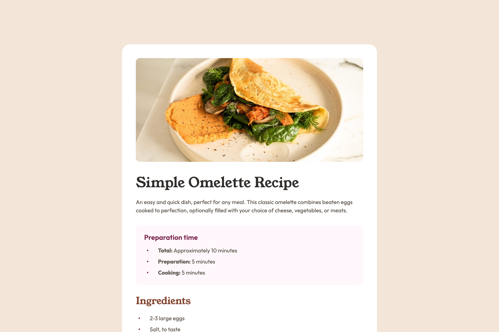

# Frontend Mentor - Recipe page solution

This is a solution to the [Recipe page challenge on Frontend Mentor](https://www.frontendmentor.io/challenges/recipe-page-KiTsR8QQKm). Frontend Mentor challenges help you improve your coding skills by building realistic projects.

## Table of contents

- [Overview](#overview)
  - [The challenge](#the-challenge)
  - [Screenshot](#screenshot)
  - [Links](#links)
- [My process](#my-process)
  - [Built with](#built-with)
  - [What I learned](#what-i-learned)
  - [Useful resources](#useful-resources)
- [Author](#author)

## Overview

### Screenshot



### Links

- Solution URL: [GitHub Repo](https://github.com/bulhakovolexii/recipe-page)
- Live Site URL: [GitHub Pages](https://your-live-site-url.com)

## My process

### Built with

- Semantic HTML5 markup
- [Normalize.css](https://necolas.github.io/normalize.css/)
- [Sass](http://sass-lang.com/)
- Flexbox

### What I learned

While working on this project, the most interesting part for me was customizing bullets and numbering in ordered and unordered lists. I had to use CSS counters. I had done something similar before, but a long time ago, so I had to consult the documentation to recall how it works.

```scss
.instructions__list {
  counter-reset: item;
}

.instructions__list li::before {
  counter-increment: item;
  content: counter(item) ".";
}
```

I also tried to style the bullets using the `::marker` pseudo-element, but unfortunately, it didn’t work as expected because it doesn’t support certain CSS properties, such as margin.

Additionally, while comparing the project with the references using the Pixel Perfect Chrome extension, I noticed that the mockups included in the project starter pack did not match the designs in Figma. Therefore, I decided to follow the Figma files instead of relying on the mockup images.

### Useful resources

- [Sass installation](https://sass-lang.com/install/) - Here you can find instructions on installing the preprocessor and setting up a project for development.
- [PerfectPixel by WellDoneCode](https://www.welldonecode.com/perfectpixel/) - Chrome extension for overlaying and comparing layout against reference screenshots.

## Author

- GitHub - [@bulhakovolexii](https://github.com/bulhakovolexii)
- Frontend Mentor - [@bulhakovolexii](https://www.frontendmentor.io/profile/bulhakovolexii)
- LinkedIn - [@bulhakovolexii](https://www.linkedin.com/in/bulhakovolexii/)
